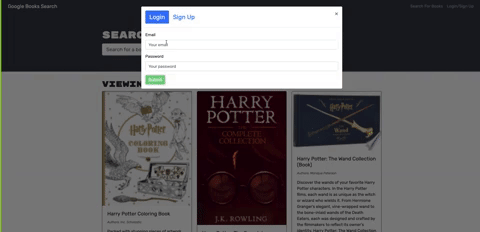

# book-search-engine
Book Search engine is a fully functioning Google Books API search engine built with a RESTful API. The app was built using the MERN stack with a React front end, MongoDB database, and Node.js/Express.js server and API. It's set up to allow users to save book searches and access the saved ones by logging in/signing up.

## Usage
1. npm install
2. npm run develop
3. (note: if link hasn't been visited in a while it may take a minute for Heroku to launch the website)

## Mock Up

## Technologies Used 

* React
* JavaScript 
* Node.js
* Express.js
* MongoDB 
* MongoDB Atlas 
* Mongoose 
* GraphQL 
* Apollo Server Express 
* JSON Web Token 
* bcrypt 
* Bootstrap 
* Git 
* Github
* Visual Studio Code 
* ScreenToGif 
* Heroku 

## Deployed Link

* [See Github Site](#) https://github.com/umeramalek
* [See Live Site](#) https://stark-sands-59831.herokuapp.com/ 

## Authors

* **UMERA MALEK** 

- [Link to Portfolio Site](https://umeramalek.github.io/umeramalek-portfolio-3/)
- [Link to Github](https://github.com/umeramalek)
- [Link to LinkedIn](www.linkedin.com/in/umeramalek)

